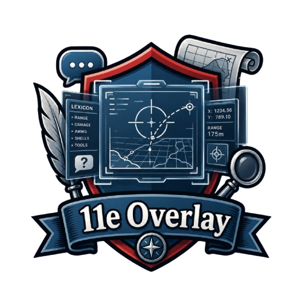

# 11eOverlay

Overlay de jeu transparent pour Foxhole, intégré à l'API **ArtyCon**.  
Affiche en temps réel les groupes d'artillerie, batteries, cibles et solutions de tir
pour les instances dont l'utilisateur connecté est membre.

**Stack :** Tauri v2 (Rust) + TypeScript + Vite  
**Cible de déploiement :** Windows x86_64 (cross-compilé depuis Linux)  
**Authentification :** OAuth2 loopback Discord ou login local + tokens JWT Bearer

> [!IMPORTANT]
> Lors du premier lancement, Windows peut afficher une alerte **Microsoft Defender SmartScreen**.
> Ce comportement est normal tant que l'application n'est pas signée avec un certificat reconnu par Microsoft.
> En cas de doute, le code source est entièrement public et auditable: [github.com/NapoSky/11eOverlay](https://github.com/NapoSky/11eOverlay).

---

## Sommaire

1. [Prérequis](#prérequis)
2. [Environnement de développement Linux](#environnement-de-développement-linux)
3. [Cross-compilation Windows](#cross-compilation-windows)
4. [Commandes](#commandes)
5. [Structure du projet](#structure-du-projet)
6. [Architecture](#architecture)
7. [Contribuer](#contribuer)

---

## Prérequis

| Outil | Version min | Notes |
|---|---|---|
| Rust (stable) | 1.80+ | via `rustup` |
| Node.js | 24+ | LTS recommandé |
| pnpm | 11+ | package manager |
| clang + llvm | 14+ | nécessaire pour cargo-xwin |
| cargo-xwin | 0.20+ | `cargo install cargo-xwin` |

---

## Environnement de développement Linux

### 1. Dépendances système (Debian / Ubuntu)

```bash
sudo apt update
sudo apt install -y \
  build-essential \
  curl \
  wget \
  file \
  pkg-config \
  clang \
  llvm \
  libdbus-1-dev \
  libglib2.0-dev \
  libsoup-3.0-dev \
  libwebkit2gtk-4.1-dev \
  libgtk-3-dev \
  libjavascriptcoregtk-4.1-dev \
  libayatana-appindicator3-dev \
  librsvg2-dev \
  libssl-dev \
  libxdo-dev
```

> **Note :** `libxdo-dev` est requis par `tauri-plugin-global-shortcut` pour la
> détection des touches sur X11.

### 2. Rust

```bash
# Installer rustup si absent
curl --proto '=https' --tlsv1.2 -sSf https://sh.rustup.rs | sh
source "$HOME/.cargo/env"

# Vérifier
rustc --version
```

### 3. Node.js

Utiliser [nvm](https://github.com/nvm-sh/nvm) ou le gestionnaire de paquets de la distro :

```bash
# Via nvm (recommandé)
curl -o- https://raw.githubusercontent.com/nvm-sh/nvm/v0.40.0/install.sh | bash
nvm install --lts
nvm use --lts
```

### 4. Dépendances pnpm

```bash
pnpm install
```

---

## Cross-compilation Windows

Voir le guide détaillé : [docs/cross-compilation.md](docs/cross-compilation.md)

**Résumé rapide :**

```bash
# Ajouter la cible Windows MSVC
rustup target add x86_64-pc-windows-msvc

# Installer cargo-xwin
cargo install cargo-xwin

# Compiler (génère un .exe dans src-tauri/target/x86_64-pc-windows-msvc/release/)
pnpm run package
```

La première exécution télécharge le Windows SDK (~1 Go) dans `~/.xwin-cache`.
Les compilations suivantes réutilisent le cache.

---

## Commandes

| Commande | Description |
|---|---|
| `pnpm run dev` | Lance Tauri en mode dev (hot-reload, fenêtre native Linux) |
| `pnpm run dev:vite` | Lance uniquement le serveur Vite (port 1420) |
| `pnpm run build:vite` | Build le frontend (obfusqué en production) |
| `pnpm run package` | Cross-compile pour Windows → `.exe` sans installeur |
| `pnpm run test` | Lance la suite de tests Vitest |
| `pnpm run test:coverage` | Tests avec rapport de couverture |
| `pnpm run typecheck` | Vérification TypeScript sans émission |

---

## Structure du projet

```
11eOverlay/
├── src/
│   └── renderer/
│       ├── overlay/        # Fenêtre overlay principale (transparent, always-on-top)
│       └── settings/       # Fenêtre de configuration
├── src-tauri/
│   └── src/
│       ├── main.rs         # Point d'entrée Tauri, gestion des fenêtres et tray
│       ├── settings.rs     # Persistance des paramètres utilisateur
│       ├── content.rs      # Chargement des données statiques (content.json)
│       └── api/
│           ├── auth.rs     # OAuth2 loopback + login local
│           ├── client.rs   # Client HTTP (reqwest + rustls)
│           ├── sse.rs      # Connexion Server-Sent Events temps réel
│           ├── tokens.rs   # Stockage chiffré des tokens (AES-256-GCM)
│           ├── crypto.rs   # Dérivation de clé (HKDF-SHA256)
│           └── types.rs    # Types partagés Rust
└── src/shared/
    ├── types.ts            # Types partagés TypeScript
    └── settings.ts         # Interface des paramètres
```

---

## Architecture

```
┌──────────────────────────────────────────────┐
│  Frontend (TypeScript + Vite)                │
│  overlay/main.ts ←──SSE──→ settings/main.ts  │
└────────────────┬─────────────────────────────┘
                 │ Tauri IPC (invoke / listen)
┌────────────────▼─────────────────────────────┐
│  Backend Rust (Tauri v2)                     │
│  ┌──────────┐  ┌──────────┐  ┌────────────┐ │
│  │ ApiClient│  │SseManager│  │ TokenStore │ │
│  │ (reqwest)│  │ (tokio)  │  │ (AES-GCM)  │ │
│  └────┬─────┘  └────┬─────┘  └────────────┘ │
└───────┼─────────────┼────────────────────────┘
        │             │ HTTPS + Bearer JWT
        ▼             ▼
   ArtyCon API  (https://artycon.11e-foxhole.com)
```

### Sécurité notable

- Tokens JWT stockés chiffrés sur disque (AES-256-GCM, clé dérivée via HKDF depuis un secret machine-specific)
- Transport exclusivement via `rustls` (pas d'OpenSSL système)
- CSP stricte sur les WebView
- User-Agent bindé au token (hash SHA-256 côté serveur)

---

## Contribuer

Les contributions sont les bienvenues. Voir [CONTRIBUTING.md](CONTRIBUTING.md) pour les détails.
