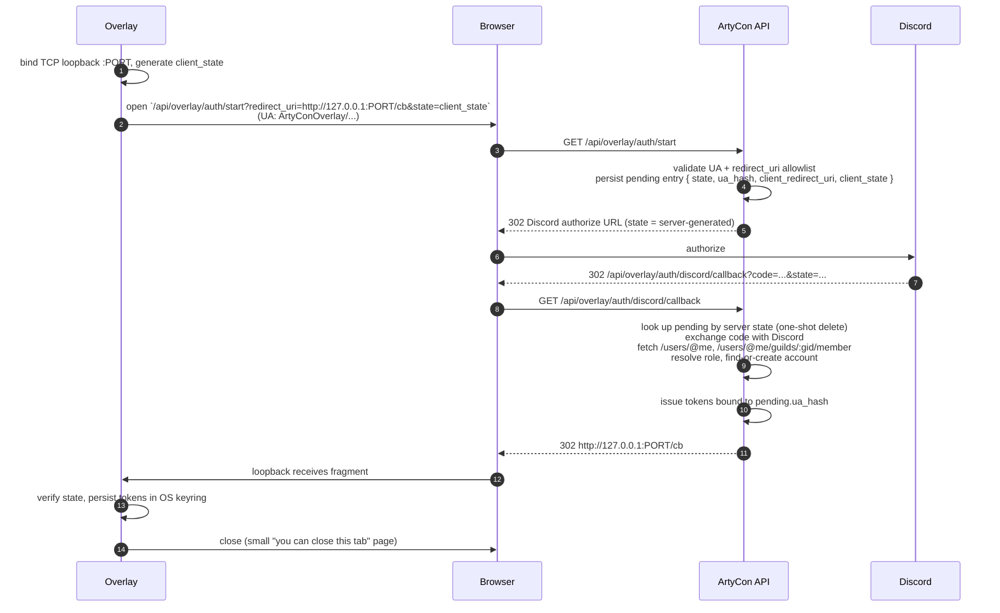
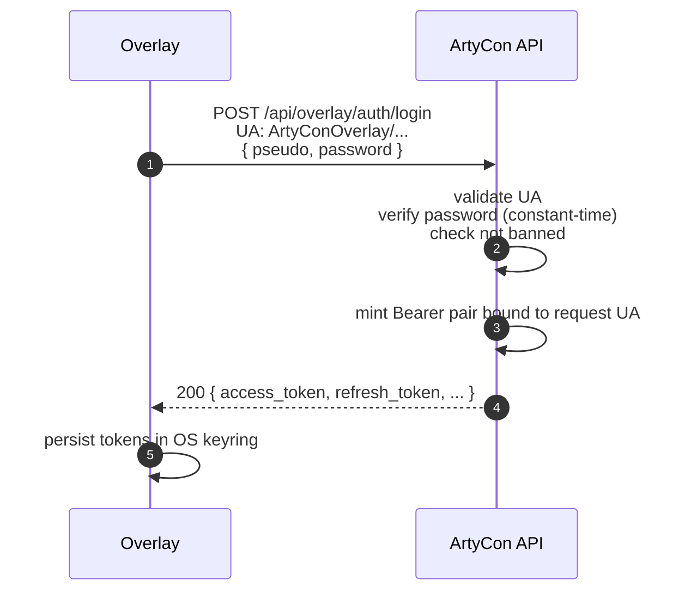

# ArtyCon Overlay Integration Guide

> Status: stable contract for ArtyCon API `overlay` namespace.
> Audience: implementors of a third-party desktop overlay (Node.js + Rust +
> WebView, or any other native client) that wants to embed ArtyCon read-only
> data inside their own UI.

This document describes **everything you need to build a compliant overlay
client**. The contract is intentionally narrow: read-only access to
artillery groups, batteries, targets, and pre-computed firing solutions for
the instances the authenticated user is already a member of.

---

## 1. Threat model & design choices

The overlay namespace is mounted at `/api/overlay/*` and is **completely
opt-in**. It is only registered when **all** of the following env vars are
set on the API:

| Variable | Purpose |
|---|---|
| `OVERLAY_JWT_SECRET` (≥ 32 chars) | HS256 signing key for access tokens |
| `OVERLAY_USER_AGENT_ALLOWLIST` | CSV of JS regex patterns matched against the `User-Agent` header |
| `OVERLAY_REDIRECT_URI_ALLOWLIST` | CSV of JS regex patterns matched against the loopback `redirect_uri` |
| `OVERLAY_ACCESS_TOKEN_TTL` (default 900) | Access token lifetime in seconds |
| `OVERLAY_REFRESH_TOKEN_TTL` (default 2 592 000) | Refresh token lifetime in seconds |
| `DISCORD_CLIENT_ID` / `DISCORD_CLIENT_SECRET` / `DISCORD_REDIRECT_URI` / `DISCORD_GUILD_ID` | Discord OAuth & guild membership check |

If any of these is missing the entire `/api/overlay/*` tree is disabled
(every request returns `404` from Fastify's router).

The contract differs from the SPA contract on four points:

1. **Bearer tokens, not cookies.** No `Set-Cookie`, no CSRF token. All
   requests must carry `Authorization: Bearer <access_token>`.
2. **Two auth methods.** Either Discord OAuth via loopback (§3) **or**
   local credentials login (§3bis) using the same pseudo+password as the
   SPA. Both produce the same Bearer pair format.
3. **Hard User-Agent gate.** Every overlay request must match a regex in
   `OVERLAY_USER_AGENT_ALLOWLIST` **and** must match the User-Agent that
   was presented when the token pair was issued. Token-UA binding is
   enforced via a SHA-256 hash stored in the JWT claim (`ua_hash`) and the
   `overlay_token` DB row.
4. **Read-only.** No POST/PATCH/DELETE on overlay routes. The overlay
   cannot create groups, batteries, targets, or modify the map. Only
   reads + SSE.

---

## 2. User-Agent format

The overlay **must** send a stable, recognisable User-Agent on every
request. Recommended format:

```
ArtyConOverlay/<semver> (<platform>)
```

Examples:
- `ArtyConOverlay/0.1.0 (linux-x86_64)`
- `ArtyConOverlay/0.1.0 (windows-x86_64)`
- `ArtyConOverlay/0.1.0 (darwin-arm64)`

The API operator picks the allowlist regex. A safe default matching the
above examples:

```
^ArtyConOverlay/\d+\.\d+\.\d+ \([^)]+\)$
```

The User-Agent **must be byte-identical** across the login (`/start`),
refresh, and every API call. The platform string is part of the hash, so
two overlay binaries running on different OSes get distinct tokens — even
if they share the same Discord account.

---

## 3. OAuth loopback flow



### 3.1 Step-by-step (overlay side)

1. **Bind a loopback listener.** Pick a free random TCP port on
   `127.0.0.1` (or `localhost`) and start a tiny HTTP server with a
   single route handling `GET /cb`.
2. **Generate a client state.** 32 bytes of CSPRNG, hex-encoded. Keep
   it in memory.
3. **Build the start URL:**
   `GET https://<api-host>/api/overlay/auth/start?redirect_uri=<encoded loopback>&state=<client_state>`
4. **Open the system browser** at that URL (with the overlay's
   User-Agent header — usually delegated to the default browser, so the
   server-side UA gate applies to the **overlay's first hit**, not the
   browser's subsequent hits).

   > Note: the browser hitting `/start` is the one whose UA is checked.
   > If you control the browser process (e.g. embedded WebView), set
   > the overlay UA on it. If you delegate to the OS default browser
   > you cannot control the UA — in that case make the overlay itself
   > issue the `/start` request and only open the browser at the
   > Discord authorize URL returned in `Location`.

5. **Wait on the loopback.** When `GET /cb` is hit, parse the URL
   fragment client-side (the fragment is **not** sent in the request,
   so the loopback HTML must contain JavaScript that posts the
   fragment back to itself, e.g. via `fetch('/finish', { body: location.hash })`).
6. **Verify state.** The `state` in the fragment must equal the
   `client_state` you generated. Reject otherwise.
7. **Persist tokens** in the OS keyring (libsecret on Linux,
   Credential Manager on Windows, Keychain on macOS — see the
   [`keyring`](https://crates.io/crates/keyring) Rust crate).

### 3.2 Step-by-step (API side)

The API:

1. Validates `User-Agent` against `OVERLAY_USER_AGENT_ALLOWLIST`. On
   failure → `403 OVERLAY_USER_AGENT_REJECTED`.
2. Validates `redirect_uri` against `OVERLAY_REDIRECT_URI_ALLOWLIST`.
   On failure → `400 REDIRECT_URI_REJECTED`.
3. Stores `{ ua_hash, client_redirect_uri, client_state, expires_at }`
   in an in-process Map keyed by a **server-generated** OAuth `state`
   (TTL 5 minutes, max 500 entries, garbage-collected on the fly).
4. Redirects to Discord's authorize endpoint with `client_id`,
   `scope=identify guilds.members.read`, `response_type=code`, the
   API's `redirect_uri`, and the server `state`.

On the callback:

1. Looks up the pending entry by server `state` (**one-shot**: removed
   from the map immediately, regardless of outcome).
2. Exchanges the code with Discord, fetches `/users/@me` and the guild
   member endpoint, resolves the role.
3. Calls `ResolveDiscordAccountUseCase` (find-or-create account, sync
   role). **No cookie session is created** — this is intentionally
   different from the SPA flow.
4. Mints the token pair **bound to the original `ua_hash`** stored in
   the pending entry (not the browser's UA).
5. Redirects to `<client_redirect_uri>#access_token=...&refresh_token=...&access_token_expires_in=...&refresh_token_expires_in=...&state=<client_state>&token_type=Bearer`.

### 3.3 Security properties

- **Authorization Code grant** (with state) — no PKCE because the
  client secret is held by the API, which acts as the OAuth client.
  The overlay never sees the Discord client_secret.
- **State binding** prevents CSRF + fragment replay across different
  overlay instances.
- **UA hash binding** prevents token replay across different clients
  even if the redirect URL fragment is captured (loopback redirects
  through the user's browser leave traces in browser history/log
  files).
- **One-shot pending state.** The map entry is deleted on lookup, so a
  leaked Discord `code` can't be replayed.
- **Pending state TTL** of 5 minutes caps replay window.

---

## 3bis. Local credentials flow

For accounts that have a local password (e.g. created via the SPA's
`/register`), the overlay can skip the Discord browser dance and POST
credentials directly. The output is the same Bearer pair — choose the
flow per UX preference, both can coexist for the same account.



Notes:
- **No CSRF, no cookies.** The endpoint is on the overlay namespace and
  uses Bearer-only semantics like the rest of `/api/overlay/*`.
- **UA gate applies** at login time. The token pair is bound to the UA
  presented at login; subsequent calls must use the same UA.
- **Anti-enumeration:** unknown pseudo and bad password both return the
  same `401 OVERLAY_LOGIN_FAILED`. Constant-time hashing is performed
  even when the account does not exist.
- **Banned accounts** are refused with `403 OVERLAY_ACCOUNT_DISABLED`.
- **Accounts without a passwordHash** (Discord-only users) cannot use
  this endpoint and will get `401 OVERLAY_LOGIN_FAILED`.

---

## 4. Endpoints reference

All routes are prefixed with `/api/overlay/`.

### 4.1 `GET /api/overlay/auth/start`

Query params:
- `redirect_uri` (string, URL) — overlay loopback callback. Must match
  `OVERLAY_REDIRECT_URI_ALLOWLIST`.
- `state` (string, ≥ 8 chars) — opaque value chosen by the overlay,
  echoed back on the final loopback redirect.

Headers:
- `User-Agent: <overlay UA>` — required, must match allowlist.

Responses:
- `302 Found` → `Location: https://discord.com/api/oauth2/authorize?...`
- `400 VALIDATION_ERROR` — missing or bad params
- `400 REDIRECT_URI_REJECTED` — uri not in allowlist
- `403 OVERLAY_USER_AGENT_REJECTED` — UA not in allowlist

### 4.2 `GET /api/overlay/auth/discord/callback`

You never call this directly. Discord redirects to it. On success it
redirects to your loopback URI with a fragment carrying the token
pair. See §3.

Error responses (rendered as JSON, not redirected — useful for debugging):
- `400 VALIDATION_ERROR` — missing `code` / `state`
- `400 STATE_UNKNOWN` / `STATE_EXPIRED`
- `400 DISCORD_AUTH_DENIED` — user declined consent on Discord
- `403 NOT_IN_GUILD` — user not in the configured Discord guild
- `403 ROLE_NOT_ALLOWED` — user not in `DISCORD_ALLOWED_ROLE_IDS`
- `502 DISCORD_TOKEN_FAILED` / `DISCORD_FETCH_FAILED` / `DISCORD_GUILD_FETCH_FAILED`

### 4.3 `POST /api/overlay/auth/login`

Local credentials login. Bypasses the Discord OAuth dance for accounts
that have a password set.

Headers: `User-Agent: <overlay UA>`, `Content-Type: application/json`.
Body:

```json
{ "pseudo": "alice", "password": "..." }
```

On success returns the same shape as `/refresh`:

```json
{
  "access_token": "eyJ...",
  "refresh_token": "<opaque token>",
  "access_token_expires_in": 900,
  "refresh_token_expires_in": 2592000,
  "token_type": "Bearer"
}
```

Error codes:
- `400 VALIDATION_ERROR` — body missing/invalid
- `401 OVERLAY_LOGIN_FAILED` — unknown pseudo, missing password hash,
  or wrong password (single code, anti-enumeration)
- `403 OVERLAY_USER_AGENT_REJECTED` — UA not in allowlist
- `403 OVERLAY_ACCOUNT_DISABLED` — account banned

### 4.4 `POST /api/overlay/auth/refresh`

Body: `{ "refresh_token": "<plain refresh token>" }`
Headers: `User-Agent: <same as issuance>`

On success returns:

```json
{
  "access_token": "eyJ...",
  "refresh_token": "<new opaque token>",
  "access_token_expires_in": 900,
  "refresh_token_expires_in": 2592000,
  "token_type": "Bearer"
}
```

Refresh is **rotating**: the presented refresh token is replaced
atomically; presenting it a second time yields `401`. If a refresh
fails with `OVERLAY_UA_MISMATCH`, the API **revokes the entire token
chain** (defensive: treats it as theft).

Error codes (all `401`):
- `OVERLAY_REFRESH_INVALID` — unknown refresh hash
- `OVERLAY_REFRESH_EXPIRED` — past TTL
- `OVERLAY_REFRESH_REVOKED` — already used / revoked / logged out
- `OVERLAY_UA_MISMATCH` — UA differs from issuance

### 4.5 `POST /api/overlay/auth/logout`

Headers: `Authorization: Bearer <access_token>`, `User-Agent: <UA>`.
Revokes the token associated with the current access token's `tid`.
Returns `204 No Content`.

### 4.6 `GET /api/overlay/me`

Returns the authenticated overlay account:

```json
{
  "id": "uuid",
  "pseudo": "Tester",
  "role": "user" | "admin",
  "discordId": "snowflake" | null
}
```

### 4.7 `GET /api/overlay/instances`

Lists instances the caller is a member of:

```json
[
  { "id": "uuid", "name": "Operation X", "ownerAccountId": "uuid", "createdAt": "ISO8601" }
]
```

### 4.8 `GET /api/overlay/instances/:id/layers`

Lists layers of an instance:

```json
[ { "id": "uuid", "instanceId": "uuid", "name": "L", "type": "arty", "createdAt": "ISO8601", "updatedAt": "ISO8601" } ]
```

### 4.9 `GET /api/overlay/instances/:id/layers/:layerId/snapshot`

The big one — full read-only snapshot used to render the overlay's
range/azimuth widgets:

```json
{
  "layerId": "uuid",
  "groups": [
    {
      "id": "uuid",
      "name": "Alpha",
      "color": "#ff0000",
      "createdAt": "...",
      "lastUsedAt": "...",
      "focusedTargetId": "uuid" | null,
      "batteries": [
        {
          "id": "uuid",
          "name": "B1",
          "type": "120w",
          "position": { "x": 0, "y": 0 },
          "angleRad": 0,
          "lengthM": 0,
          "groupId": "uuid",
          "updatedAt": "...",
          "solutions": [
            {
              "targetId": "uuid",
              "distance": 200.0,
              "angle": 90.0,
              "windBias": { "x": 0, "y": 0 }
            }
          ]
        }
      ],
      "targets": [
        {
          "id": "uuid",
          "position": { "x": 200, "y": 0 },
          "windForce": 1,
          "windDirection": 0,
          "groupId": "uuid",
          "updatedAt": "..."
        }
      ]
    }
  ]
}
```

**Solutions semantics:** for every battery in a group, the API
pre-computes a `solve()` against every target in the **same** group
(cross-group solutions are intentionally absent). `distance` is in
meters, `angle` is degrees (conventional bearing), `windBias` is the
impact offset in meters caused by current wind conditions.

### 4.10 `GET /api/overlay/instances/:id/events`

Server-Sent Events stream for live updates. **Bearer cannot be sent
in headers for `EventSource` in browsers** — for parity with browser
clients, this endpoint **also** accepts `?access_token=<token>` in
the query string. Native clients should still prefer the
`Authorization` header.

Headers/query:
- `Authorization: Bearer <token>` **or** `?access_token=<token>`
- `User-Agent: <overlay UA>`

Events emitted — each event is a named SSE event with JSON `data`:
- `open` — `{ instanceId, client: "overlay" }`
- `presence.changed` — `{ type: "presence.changed", instanceId, payload: { count: number }, ts: number }`
- `instance.changed` — `{ type: "instance.changed", instanceId, payload: { method: "POST"|"PATCH"|"DELETE", url: string }, ts: number }`

On `instance.changed`: re-fetch the snapshot (or targeted layer/group data).

---

## 5. Client implementation playbook

### 5.1 Token storage

- **Use the OS keyring**, never plain files.
  - Rust: [`keyring`](https://crates.io/crates/keyring) crate.
  - Node.js: [`keytar`](https://www.npmjs.com/package/keytar) (be aware
    of its maintenance status; consider FFI to `keyring-rs` if needed).
- Store **access** and **refresh** under distinct keyring entries
  (`artycon.overlay.access`, `artycon.overlay.refresh`).
- Wipe both on logout (and after a `OVERLAY_REFRESH_REVOKED` /
  `OVERLAY_UA_MISMATCH` error).

### 5.2 Refresh interceptor

Wrap your HTTP client. On `401 OVERLAY_TOKEN_EXPIRED`, **once**,
attempt refresh, then retry the original request. Use a mutex so
concurrent requests don't all attempt refresh in parallel.

```rust
// pseudo-code
async fn request<T>(method, url, body) -> Result<T> {
  let resp = http(method, url, body, auth_header(access_token)).await?;
  if resp.status() == 401 && resp.body.error.code == "OVERLAY_TOKEN_EXPIRED" {
    let _g = REFRESH_MUTEX.lock().await;
    // double-check: another task may have already refreshed
    if access_token_is_still_old() {
      refresh().await?;
    }
    return http(method, url, body, auth_header(access_token)).await;
  }
  resp.json::<T>()
}
```

On any of these refresh errors → **clear keyring**, surface a "Please
log in again" UX:
- `OVERLAY_REFRESH_INVALID`
- `OVERLAY_REFRESH_EXPIRED`
- `OVERLAY_REFRESH_REVOKED`
- `OVERLAY_UA_MISMATCH`

### 5.3 SSE reconnect & backoff

`EventSource` reconnects automatically; if you implement the SSE
client manually (recommended for native, since browser EventSource
can't set headers):

- Initial connect delay: 0 s.
- On disconnect: 1 s, then 2 s, 4 s, 8 s, 16 s, capped at 30 s.
- Reset to 1 s after 60 s of stable connection.
- On `401` during SSE: refresh, then reconnect once. If refresh fails →
  fall back to login flow.

### 5.4 Conformance checklist

Before shipping:

- [ ] Single, stable User-Agent string matching the allowlist regex.
- [ ] OAuth state is at least 16 random bytes, base64 or hex.
- [ ] Loopback uses `127.0.0.1`, not `0.0.0.0`. Random port.
- [ ] Loopback only handles `GET /cb` and serves a static HTML that
      extracts the fragment via JavaScript (server can't see it).
- [ ] Tokens stored in OS keyring, never in plain text or shell env.
- [ ] Refresh is mutex-guarded.
- [ ] Refresh failures wipe both keyring entries.
- [ ] On `OVERLAY_USER_AGENT_REJECTED` (403) → surface "Your overlay
      build is not allowed by this server", do not retry.
- [ ] SSE auth uses `?access_token=` only as a last resort.
- [ ] All requests carry `Authorization: Bearer` + matching `User-Agent`.

---

## 6. Curl examples

```bash
# 1) Health-check the overlay namespace is enabled (any allowed UA works).
curl -i 'https://api.example/api/overlay/auth/start?redirect_uri=http://127.0.0.1:53123/cb&state=abc12345' \
  -H 'User-Agent: ArtyConOverlay/0.1.0 (linux-x86_64)'
# → 302 Location: https://discord.com/api/oauth2/authorize?...

# 2) After you have a token pair, list instances:
curl -H 'Authorization: Bearer eyJ...' \
     -H 'User-Agent: ArtyConOverlay/0.1.0 (linux-x86_64)' \
     https://api.example/api/overlay/instances

# 3) Snapshot:
curl -H 'Authorization: Bearer eyJ...' \
     -H 'User-Agent: ArtyConOverlay/0.1.0 (linux-x86_64)' \
     'https://api.example/api/overlay/instances/<id>/layers/<lid>/snapshot' | jq .

# 4) Refresh:
curl -X POST -H 'Content-Type: application/json' \
     -H 'User-Agent: ArtyConOverlay/0.1.0 (linux-x86_64)' \
     -d '{"refresh_token":"<plain>"}' \
     https://api.example/api/overlay/auth/refresh
```

---

## 7. Error code catalog

| HTTP | Code | Meaning |
|---|---|---|
| 400 | `VALIDATION_ERROR` | Malformed query/body |
| 400 | `REDIRECT_URI_REJECTED` | `redirect_uri` not in allowlist |
| 400 | `STATE_UNKNOWN` | Pending state map miss |
| 400 | `STATE_EXPIRED` | Pending state TTL exceeded |
| 400 | `DISCORD_AUTH_DENIED` | User declined consent |
| 401 | `OVERLAY_UNAUTHORIZED` | Missing/malformed Bearer |
| 401 | `OVERLAY_TOKEN_INVALID` | Bad signature / claims |
| 401 | `OVERLAY_TOKEN_EXPIRED` | Access token past `exp` |
| 401 | `OVERLAY_TOKEN_REVOKED` | Token revoked (logout, defensive revoke) |
| 401 | `OVERLAY_UA_MISMATCH` | UA differs from issuance |
| 401 | `OVERLAY_REFRESH_INVALID` | Refresh token unknown |
| 401 | `OVERLAY_REFRESH_EXPIRED` | Refresh past TTL |
| 401 | `OVERLAY_REFRESH_REVOKED` | Refresh already used or revoked |
| 401 | `OVERLAY_LOGIN_FAILED` | Local login: unknown pseudo or wrong password |
| 403 | `OVERLAY_DISABLED` | Overlay namespace not configured |
| 403 | `OVERLAY_USER_AGENT_REJECTED` | UA does not match allowlist |
| 403 | `OVERLAY_ACCOUNT_DISABLED` | Account banned |
| 403 | `NOT_IN_GUILD` | Discord user not in configured guild |
| 403 | `ROLE_NOT_ALLOWED` | Discord roles don't grant access |
| 502 | `DISCORD_TOKEN_FAILED` | Discord oauth2 token endpoint failed |
| 502 | `DISCORD_FETCH_FAILED` | `/users/@me` failed |
| 502 | `DISCORD_GUILD_FETCH_FAILED` | guild member fetch failed |

All error responses share the same envelope:

```json
{ "error": { "code": "...", "message": "..." } }
```
